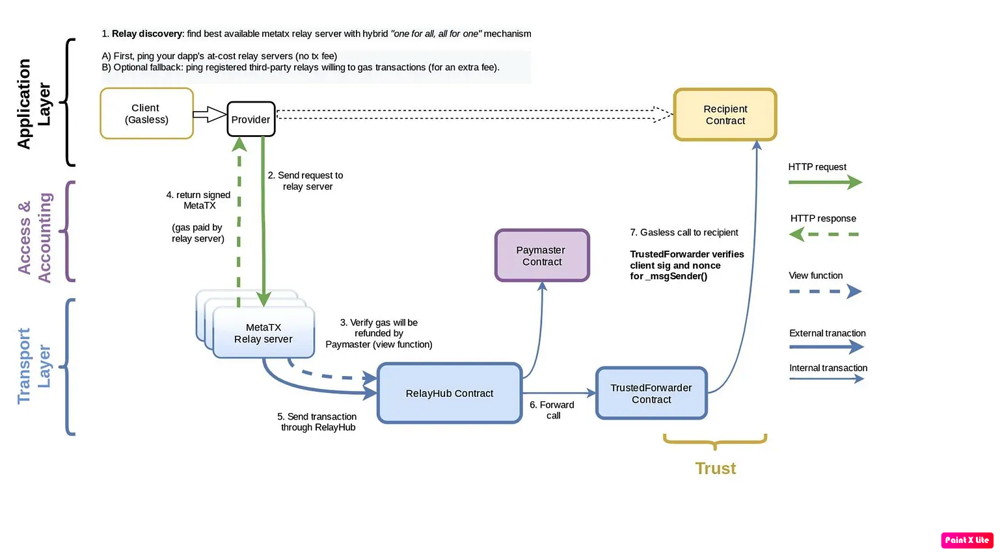
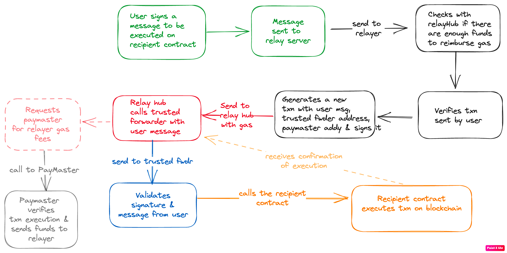

# Enzyme Finance

## Summary

Core issue here is that the inherited library `GasRelayPaymasterLib` has implemented logic for `preRelayedCall` that overrides `preRelayedCall` logic in [base contract](https://github.com/opengsn/gsn/blob/032e49adb0027814bc74308bd884c0c1f8fc8f1a/packages/contracts/src/BasePaymaster.sol#L135). While overriding itself is not a problem, critical vulnerability here comes from a fact that a key validation that checks validity of a `forwarder` goes missing in the overriden function -> and this is the root cause of all the problems. Role of forwarder is to verify the transction sent by the user & then forward it to the recipient contract - this implicitly means that the forwarder has to be trusted contract.

By overriding a key check to verify a trusted forwarder, protocol has introduced an attack vector of a malicious user introducing a fake forwarder. The forwarder can then manipulate the relay message to demand a huge fees for the relayed txn -> paymaster, assuming forwarder is genuine, ends up paying the demanded fee. An attacker can drain the funds in paymaster completely by repeatedly relaying a message with an untrusted forwarder

---

## Detail

First, lets understand how a Gasless Service Network operates

Following schematic shows the flow

Some key points here

- Purpose of the GSN is to provide a gasless experience to users who can call functions on the blockchain without paying gas for that txn

- GSN is a decentralized network of relayers which allow Dapps to pay cost of txns instead of individual users

- GSN uses meta txns - users sign a txn that contains the key data to be executed but it is the `relayers` who actually submit the txn to the Eth network - so it is the relayers who end up paying the fees

- `PayMaster` maintains an ethereum balance within the `relayhub`. Responsible for reimbursing relayers who have spent gas to execute transaction on user behalf

- `TrustedForwarder` has one single function -> to verify signature & validate that the message was indeed signed by user. As we will explore, this contract is the source of exploit

- `Relay Hub` is a smart contract that facilitates and overseas interactions among users, relayers, paymasters and recipient contracts - inessence, this is the crux of the GSN network

- `Relay Server` also known as relayer - executes txns on behalf of users by paying the requisite gas fees. Relayer receives compensation from PayMaster for the work done

- Here is the flow of logic for GSN network

---

## Key vulnerability
